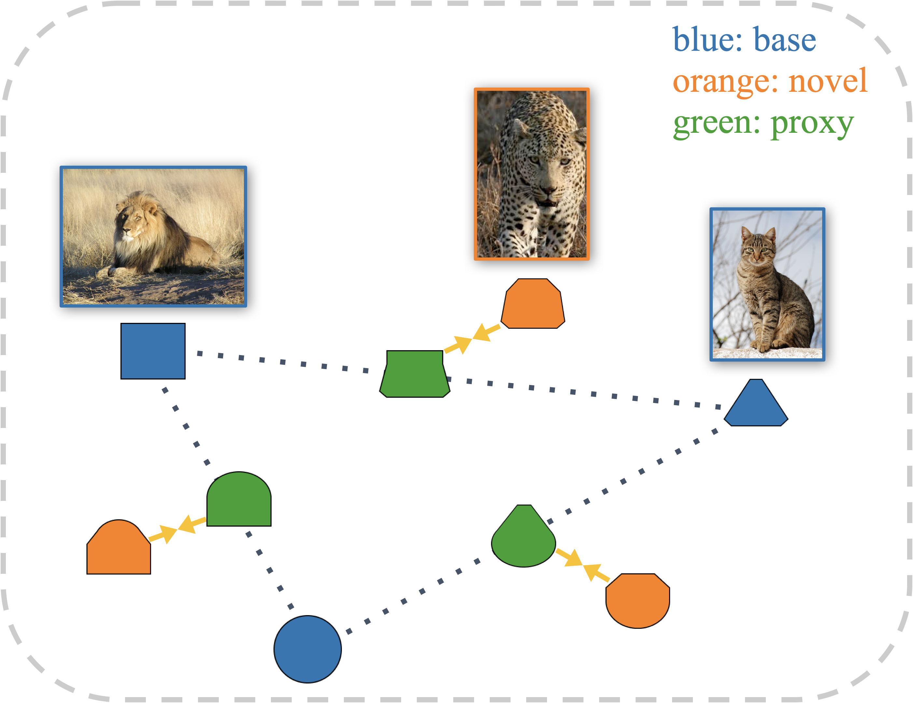

# :dart: ProxyDet

official implementation for "ProxyDet: Synthesizing Proxy Novel Classes via Classwise Mixup for Open-Vocabulary Object Detection"

<p align="center">  </p>

[Joonhyun Jeong](https://bestdeveloper691.github.io/)<sup>1,2</sup>, [Geondo Park](https://scholar.google.com/citations?user=Z8SGJ60AAAAJ&hl=ko)<sup>2</sup>, [Jayeon Yoo](http://mipal.snu.ac.kr/index.php/JaYeon_Yoo)<sup>3</sup>, [Hyungsik Jung](https://scholar.google.com/citations?user=-Be-Fz4AAAAJ&hl=ko)<sup>1</sup>, [Heesu Kim](https://scholar.google.com/citations?user=q_bEyHQAAAAJ&hl=ko)<sup>1</sup><br>

<sup>1</sup> <sub>NAVER Cloud, ImageVision</sub><br />
<sup>2</sup> <sub>KAIST</sub><br />
<sup>3</sup> <sub>Seoul National University</sub><br />

[](https://aaai.org/aaai-conference/)
[](https://arxiv.org/abs/2312.07266)
[](https://youtu.be/Hx8ckRVqH4A)
[](https://proxydet.github.io/)

## :hammer_and_wrench: Install

See [install instructions.](./docs/INSTALL.md)

## :clapper: Demo

- download LVIS + ImageNet-LVIS pretrained [weight](https://drive.google.com/file/d/1IEfoSPRGYWtaxk9sKhBf3NSBj6NWGgvt/view?usp=sharing)
- make ```models``` directory and move weight to the ```models``` directory
- run inference demo as below:

```shell
python3 demo.py \
    --config-file configs/ProxyDet_R50_Lbase_INL.yaml \
    --input .assets/desk.jpg \
    --output out.jpg \
    --vocabulary custom \
    --custom_vocabulary headphone,webcam,paper,coffe \
    --confidence-threshold 0.3 \
    --zeroshot_weight_path datasets/metadata/lvis_v1_clip_a+cname.npy \
    --opts MODEL.WEIGHTS models/proxydet_r50_w_inl.pth
```


## :fire: Training

See [training instructions](./docs/TRAINING.md).

## :chart_with_upwards_trend: evaluation

See [evaluation instructions](./docs/EVAL.md).

## :newspaper_roll: News
- **`2023/12/09`**: got accepted in AAAI-24 :partying_face:
- **`2024/01/25`**: open ProxyDet code

## :pushpin: TODO

- [x] Inference and Demo
- [x] Training codes
- [ ] Gradio web demo

## :link: Citation

If you find that this project helps your research, please consider citing as below:

```
@article{jeong2023proxydet,
  title={ProxyDet: Synthesizing Proxy Novel Classes via Classwise Mixup for Open Vocabulary Object Detection},
  author={Jeong, Joonhyun and Park, Geondo and Yoo, Jayeon and Jung, Hyungsik and Kim, Heesu},
  journal={arXiv preprint arXiv:2312.07266},
  year={2023}
}
```

## License

```
ProxyDet
Copyright (c) 2024-present NAVER Cloud Corp.

Licensed under the Apache License, Version 2.0 (the "License");
you may not use this file except in compliance with the License.
You may obtain a copy of the License at

    http://www.apache.org/licenses/LICENSE-2.0

Unless required by applicable law or agreed to in writing, software
distributed under the License is distributed on an "AS IS" BASIS,
WITHOUT WARRANTIES OR CONDITIONS OF ANY KIND, either express or implied.
See the License for the specific language governing permissions and
limitations under the License.
```
